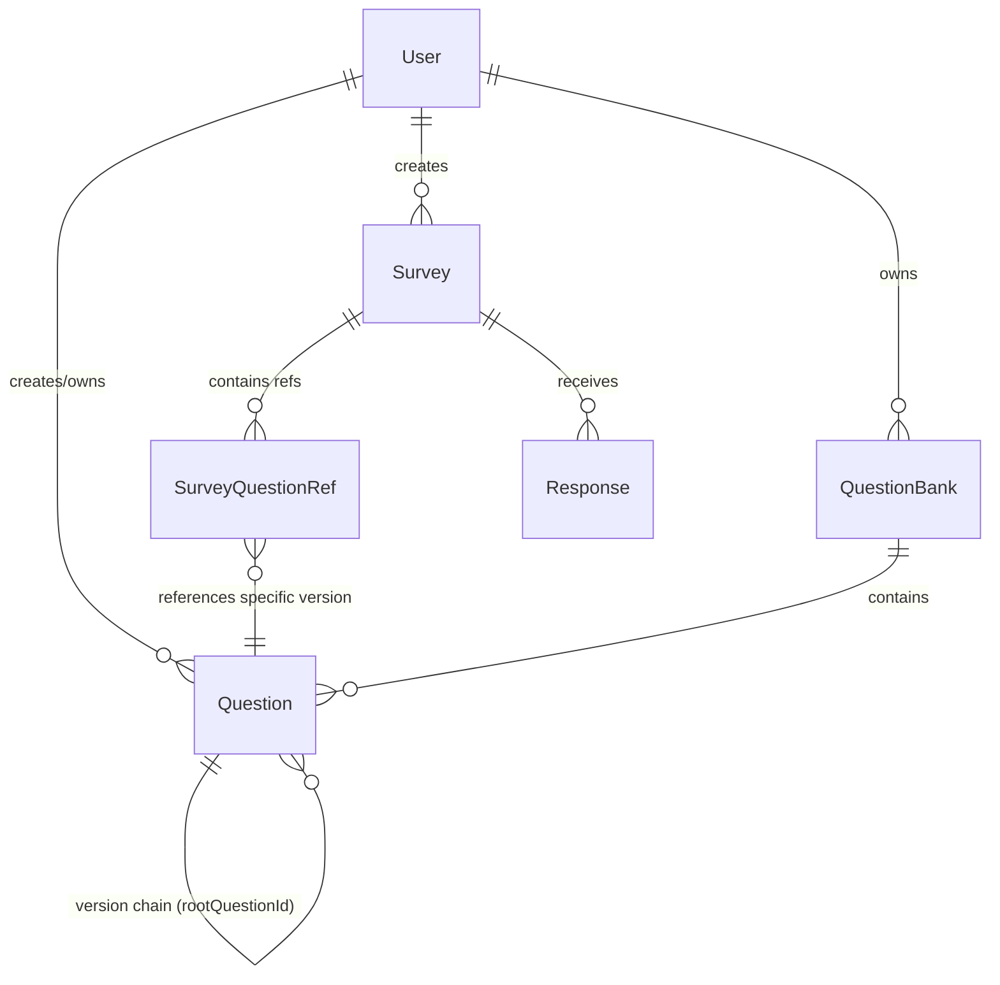

# 问卷系统需求变更实现计划（big_project_1_2）

基于 big_project_1_1 的问卷系统，实现需求变更文档中的 8 项新功能。核心变化：**题目从"嵌入在问卷中"变为"独立实体+版本管理"**。

## 用户需确认

> [!IMPORTANT]
> **数据库设计关键决策**：以下方案采用 **COW（Copy-on-Write）版本链** 模式：
> - 每次修改题目时，如果有已发布问卷引用它，则创建新版本（新文档），原版本不变
> - 用 `rootQuestionId` + `version` 形成版本链
> - 问卷通过 `questionRefs[]` 引用特定版本的题目
> 
> 这比用打快照（snapshot）的方式更节省存储，且天然支持"查看被哪些问卷引用"。

> [!WARNING]
> **共享机制**：采用 `sharedWith: [userId]` 数组方式，而不是单独的共享关系表。理由：这是小规模系统，不需要额外的集合来管理共享关系。

## 设计概览



## 提案变更

### 1. 数据模型层

---

#### [MODIFY] [Question.js](file:///f:/code/DataManagementSystem/big_project_1_2/server/models/Question.js)

重构 Question 为独立实体，不再强制绑定 surveyId：

```diff
 const questionSchema = new mongoose.Schema({
-  surveyId: {
-    type: mongoose.Schema.Types.ObjectId,
-    ref: 'Survey',
-    required: true,
-    index: true,
-  },
-  order: {
-    type: Number,
-    required: true,
-  },
+  creatorId: {          // 题目创建者
+    type: mongoose.Schema.Types.ObjectId,
+    ref: 'User',
+    required: true,
+    index: true,
+  },
+  sharedWith: [{        // 共享给哪些用户
+    type: mongoose.Schema.Types.ObjectId,
+    ref: 'User',
+  }],
+  rootQuestionId: {     // 版本链根ID，首版指向自己
+    type: mongoose.Schema.Types.ObjectId,
+    ref: 'Question',
+    default: null,
+  },
+  parentVersionId: {    // 上一版本ID
+    type: mongoose.Schema.Types.ObjectId,
+    ref: 'Question',
+    default: null,
+  },
+  version: {            // 版本号
+    type: Number,
+    default: 1,
+  },
+  isLatest: {           // 是否最新版
+    type: Boolean,
+    default: true,
+  },
   type: { ... },       // 不变
   title: { ... },      // 不变
   required: { ... },   // 不变
   options: { ... },    // 不变
   validation: { ... }, // 不变
   jumpRules: { ... },  // 不变
+  createdAt: { type: Date, default: Date.now },
+  updatedAt: { type: Date, default: Date.now },
 });
```

索引变更：
- 移除 `surveyId + order` 复合索引
- 新增 `creatorId` 索引
- 新增 `rootQuestionId` 索引（版本查询）
- 新增 `sharedWith` 索引（共享题目查询）

---

#### [MODIFY] [Survey.js](file:///f:/code/DataManagementSystem/big_project_1_2/server/models/Survey.js)

Survey 新增 questionRefs 数组来引用题目（带顺序）：

```diff
 const surveySchema = new mongoose.Schema({
   ...existing fields...
+  questionRefs: [{
+    questionId: {
+      type: mongoose.Schema.Types.ObjectId,
+      ref: 'Question',
+      required: true,
+    },
+    order: {
+      type: Number,
+      required: true,
+    },
+  }],
 });
```

---

#### [NEW] [QuestionBank.js](file:///f:/code/DataManagementSystem/big_project_1_2/server/models/QuestionBank.js)

题库模型：

```js
const questionBankSchema = new mongoose.Schema({
  name: { type: String, required: true },
  description: { type: String, default: '' },
  creatorId: { type: ObjectId, ref: 'User', required: true, index: true },
  questionIds: [{ type: ObjectId, ref: 'Question' }],  // 引用的题目（rootId）
  createdAt: { type: Date, default: Date.now },
  updatedAt: { type: Date, default: Date.now },
});
```

---

### 2. API 路由层

---

#### [NEW] [questionLib.js](file:///f:/code/DataManagementSystem/big_project_1_2/server/routes/questionLib.js)

独立题目管理 API（`/api/questions/...`）：

| 方法 | 路径 | 说明 |
|------|------|------|
| POST | /api/questions | 创建独立题目 |
| GET | /api/questions | 获取我的题目列表（含被共享的） |
| GET | /api/questions/:id | 获取题目详情 |
| PUT | /api/questions/:id | 更新题目（仅无已发布问卷引用时直接改，否则创建新版本） |
| DELETE | /api/questions/:id | 删除题目（仅无问卷引用时可删） |
| POST | /api/questions/:id/share | 共享题目给指定用户 |
| DELETE | /api/questions/:id/share/:userId | 取消共享 |
| GET | /api/questions/:id/versions | 获取版本历史 |
| POST | /api/questions/:id/revert/:versionId | 恢复到某个旧版本（创建新版本） |
| GET | /api/questions/:id/surveys | 查看题目被哪些问卷使用 |
| GET | /api/questions/:id/stats | 跨问卷单题统计 |

---

#### [MODIFY] [questions.js](file:///f:/code/DataManagementSystem/big_project_1_2/server/routes/questions.js)

原有的 survey 内题目管理改为引用方式：

| 方法 | 路径 | 说明 |
|------|------|------|
| POST | /api/surveys/:surveyId/questions | 从题目库选题添加到问卷（传 questionId） |
| POST | /api/surveys/:surveyId/questions/new | 直接在问卷里创建并添加新题 |
| GET | /api/surveys/:surveyId/questions | 获取问卷引用的所有题目（按 order） |
| PUT | /api/surveys/:surveyId/questions/reorder | 调整题目顺序 |
| DELETE | /api/surveys/:surveyId/questions/:questionId | 从问卷移除题目引用 |

---

#### [NEW] [questionBank.js](file:///f:/code/DataManagementSystem/big_project_1_2/server/routes/questionBank.js)

题库 CRUD API（`/api/question-banks/...`）：

| 方法 | 路径 | 说明 |
|------|------|------|
| POST | /api/question-banks | 创建题库 |
| GET | /api/question-banks | 获取我的题库列表 |
| GET | /api/question-banks/:id | 获取题库详情（含题目列表） |
| PUT | /api/question-banks/:id | 更新题库信息 |
| DELETE | /api/question-banks/:id | 删除题库 |
| POST | /api/question-banks/:id/questions | 向题库添加题目 |
| DELETE | /api/question-banks/:id/questions/:questionId | 从题库移除题目 |

---

#### [MODIFY] [stats.js](file:///f:/code/DataManagementSystem/big_project_1_2/server/routes/stats.js)

统计接口适配新数据结构（从 Survey.questionRefs 获取题目而非 surveyId 查询）。

#### [MODIFY] [fill.js](file:///f:/code/DataManagementSystem/big_project_1_2/server/routes/fill.js)

填写/提交接口适配新数据结构。

#### [MODIFY] [surveys.js](file:///f:/code/DataManagementSystem/big_project_1_2/server/routes/surveys.js)

删除问卷时不再级联删除题目（因为题目是独立的），只删除 responses。

#### [MODIFY] [app.js](file:///f:/code/DataManagementSystem/big_project_1_2/server/app.js)

注册新路由。

---

### 3. 前端页面

---

#### [NEW] [question-lib.html](file:///f:/code/DataManagementSystem/big_project_1_2/public/question-lib.html) + [question-lib.js](file:///f:/code/DataManagementSystem/big_project_1_2/public/js/question-lib.js)

**题目库页面**：列表展示、创建/编辑/删除题目、共享管理、版本历史、查看引用情况。

#### [NEW] [question-bank.html](file:///f:/code/DataManagementSystem/big_project_1_2/public/question-bank.html) + [question-bank.js](file:///f:/code/DataManagementSystem/big_project_1_2/public/js/question-bank.js)

**题库管理页面**：创建/管理题库，从题目库筛选添加。

#### [MODIFY] [dashboard.html](file:///f:/code/DataManagementSystem/big_project_1_2/public/dashboard.html) + [dashboard.js](file:///f:/code/DataManagementSystem/big_project_1_2/public/js/dashboard.js)

导航栏增加"题目库"和"题库"入口。

#### [MODIFY] [create.html](file:///f:/code/DataManagementSystem/big_project_1_2/public/create.html) + [create.js](file:///f:/code/DataManagementSystem/big_project_1_2/public/js/create.js)

改为"从题目库/题库选题"+"问卷内创建新题"两种方式。问卷内编辑题目时，如有已发布引用，提示创建新版本。

#### [MODIFY] [fill.js](file:///f:/code/DataManagementSystem/big_project_1_2/public/js/fill.js)

适配从 survey.questionRefs 获取题目。

#### [MODIFY] [stats.js](file:///f:/code/DataManagementSystem/big_project_1_2/public/js/stats.js)

新增跨问卷单题统计入口。

#### [MODIFY] [style.css](file:///f:/code/DataManagementSystem/big_project_1_2/public/css/style.css)

新增题目库/题库/版本历史相关样式。

---

### 4. 需求对应关系

| 需求 | 实现 |
|------|------|
| 一、保存常用题目 | Question 独立于 Survey，支持复用 |
| 二、分享题目 | `sharedWith` 字段 + share API |
| 三、修改不影响已发布 | COW：已发布问卷引用旧版本，修改时创建新版本 |
| 四、修改历史 | `rootQuestionId` + `parentVersionId` 版本链 |
| 五、多版本共存 | 不同问卷引用不同版本的 questionId |
| 六、查看引用 | `/api/questions/:id/surveys` 反查 |
| 七、题目库 | QuestionBank 模型 + CRUD API |
| 八、跨问卷统计 | `/api/questions/:id/stats` 聚合所有引用该题的 response |

## 验证计划

### 自动测试
- 修改已有测试适配新 API
- 启动服务器，通过浏览器工具验证各页面功能

### 手动验证
- 创建独立题目 → 添加到多个问卷 → 发布一个 → 修改题目 → 确认旧问卷不受影响
- 共享题目 → 其他用户可见可用
- 版本历史可查看、可恢复
- 跨问卷统计正确
