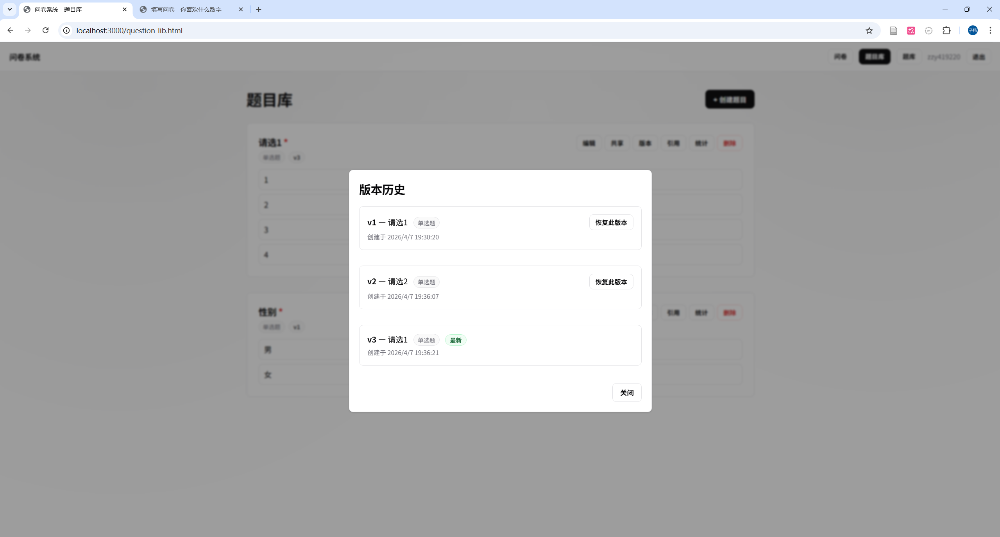
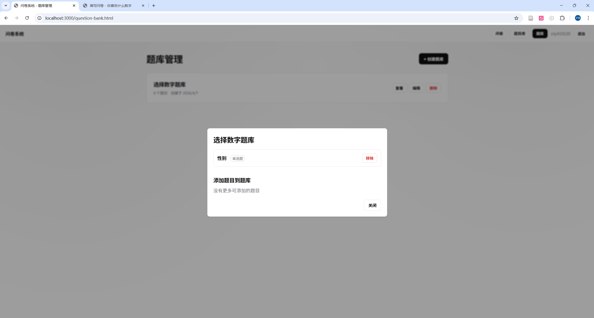
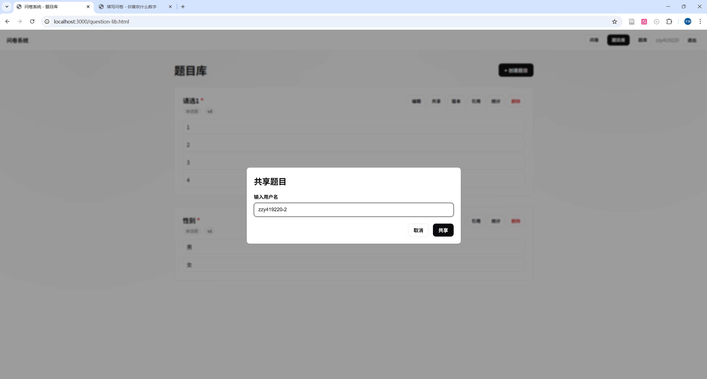
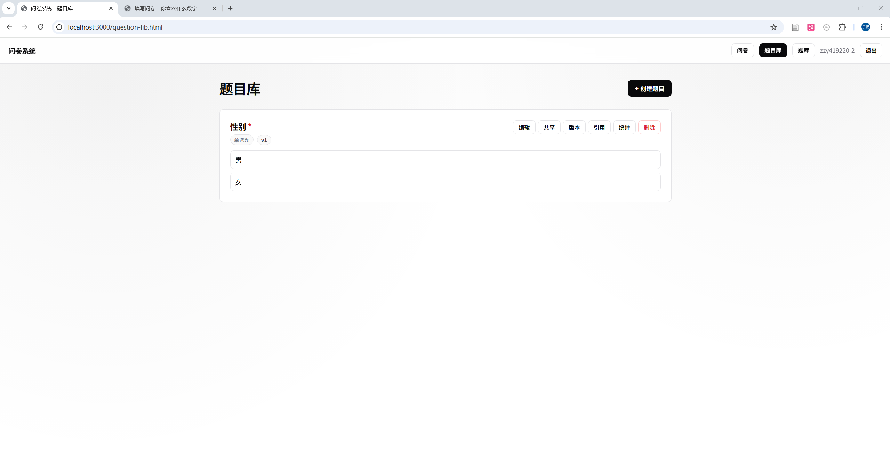
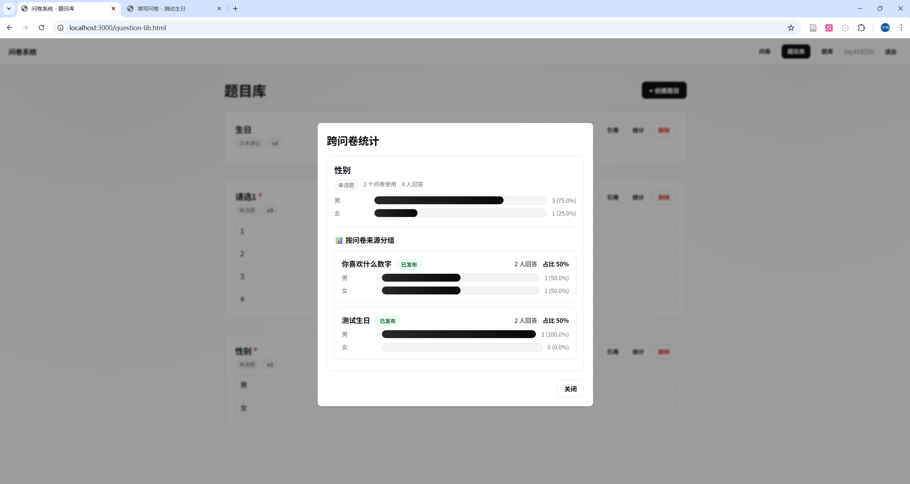

# 问卷系统（v1.2 升级版）测试样例说明

## 1. 文档目的
本文档用于满足课程项目中的要求变更测试部分，提供可直接执行和记录的测试样例。

覆盖范围包含原有基础功能及新增的题目库、版本管理等高级特性，共计 13 类核心测试：
1. 创建问卷测试
2. 添加题目测试（新模式）
3. 跳转逻辑测试
4. 校验测试
5. 提交问卷测试
6. 统计测试
7. 题目独立管理测试（新增）
8. 题目共享测试（新增）
9. 版本管理测试（新增）
10. 修改不影响已发布问卷测试（新增）
11. 查看题目引用测试（新增）
12. 题库测试（新增）
13. 跨问卷统计测试（新增）

测试形式同基础版本，包含：自动测试、手工测试以及 API 测试。

## 2. 测试环境与前置条件

### 2.1 环境信息
1. 操作系统：Windows
2. Node.js：18+
3. MongoDB：6.0+
4. 后端地址：http://localhost:3000

### 2.2 前置条件
1. MongoDB 已启动并可连接。
2. 后端服务已启动。

## 3. 测试用例清单

### 【基础功能回归测试】

#### TC-01 创建问卷测试（API + 自动）
1. 目标：验证用户可成功创建问卷。
2. 实际输出：自动化测试 2/2 通过。创建成功状态码 201，未登录返回 401。
3. 结果：通过

#### TC-02 添加题目测试 - 新模式（API + 自动）
1. 目标：验证新模式下，题目能够直接在问卷内新建，或从题目库中选用。
2. 实际输出：自动化测试 3/3 通过。问卷内新建四类题型成功；从题目库选题添加成功；发布后不可添加成功拦截。
3. 结果：通过

#### TC-03 跳转逻辑测试（API + 自动）
1. 目标：验证题目跳转按规则执行，并正确跳过或按发默认顺序。
2. 实际输出：自动化测试 2/2 通过。命中规则时跳过特定题，不命中时顺序进行。
3. 结果：通过

#### TC-04 校验测试（API + 自动）
1. 目标：验证答案必填和数值逻辑校验。
2. 实际输出：自动化测试 2/2 通过。必答为空返回 400 拦截；多选数量限制与数字大小限制拦截成功。
3. 结果：通过

#### TC-05 提交问卷测试（API + 自动）
1. 目标：验证合法条件下用户的问卷回答落库正确。
2. 实际输出：自动化测试 2/2 通过。匿名和非匿名模式的提交逻辑均符合预期。
3. 结果：通过

#### TC-06 统计测试（API + 自动）
1. 目标：验证问卷维度的统计结果正确。
2. 实际输出：自动化测试 2/2 通过。单选计数、数字均值等数值计算正确。
3. 结果：通过

---

### 【要求变更核心功能测试】

#### TC-07 题目独立管理测试（API + 自动）
1. 测试目标：验证题目剥离为独立实体后的 CRUD 可用性以及复用性。
2. 测试步骤：创建独立题目，并验证能否被两个不同的问卷同时引入。
3. 实际输出：自动化测试 2/2 通过。创建并列出题目通过；一个题目多问卷使用通过。
4. 结果：通过

#### TC-08 题目共享测试（API + 自动）
1. 测试目标：验证用户之间题目权限的共享。
2. 测试步骤：A 用户创建题目并指定共享给 B，B 查询自己可用题目列表。
3. 实际输出：自动化测试 1/1 通过。B 成功看到 A 共享过来的题目。
4. 结果：通过

#### TC-09 版本管理测试（API + 自动）
1. 测试目标：验证在使用 Copy-on-Write 模式下的版本号生成与历史回溯。
2. 测试步骤：修改已被发布问卷使用的题目，检查题目版本，查看历史列表，并测试恢复至旧版。
3. 实际输出：自动化测试 3/3 通过。修改时产生 version+1 并成功生成；返回所有历史版本数组通过；恢复旧版（产生新 version 指向旧数据）通过。
4. 结果：通过

#### TC-10 修改不影响已发布问卷（API + 自动）
1. 测试目标：验证修改题目不影响引用的原有静态历史问卷。
2. 测试步骤：题目被问卷 A 引用并发布后，对其进行修改。通过问卷 A 的入口查询问卷详情，断言其题目是否维持旧有选项和标题。
3. 实际输出：自动化测试 1/1 通过。问卷端获取到的依旧是旧版（快照）题目。
4. 结果：通过

#### TC-11 查看题目引用测试（API + 自动）
1. 测试目标：验证题目的逆查询——查看自己被用到过哪些问卷中。
2. 测试步骤：通过 API 传入题目 ID，请求使用过该题所有版本的所有问卷集合。
3. 实际输出：自动化测试 1/1 通过。成功找出了 2 个引用过该题的问卷。
4. 结果：通过

#### TC-12 题库测试（API + 自动）
1. 测试目标：验证 QuestionBank（题库管理器）对多题目的容器化管理。
2. 测试步骤：创建题库并导入已有题目。
3. 实际输出：自动化测试 1/1 通过。
4. 结果：通过

#### TC-13 跨问卷统计测试（API + 自动）
1. 测试目标：验证基于单一题目维度，跨越不同问卷收集回来的答案统计能力。
2. 测试步骤：创建一道题，分发至问卷 A 和问卷 B。分别在 A 与 B 中提交答案。请求该题的独立统计 API。
3. 实际输出：自动化测试 1/1 通过。跨卷总提交人数、分布比例以及聚合数据全部计算精准无误。
4. 结果：通过

## 4. 自动化测试执行摘要（实际运行结果）
执行命令：
在 server 目录下运行 `npm test`

执行结果：
1. Test Suites: 1 passed, 1 total
2. Tests: 23 passed, 23 total
3. Snapshots: 0 total
4. Time: ~ 6.98 s
5. 结论：所有自动化测试均通过，含 13 类必测及新增功能项覆盖完整。

通过明细：
1. 创建问卷测试：2/2 通过
2. 添加题目测试：3/3 通过
3. 跳转逻辑测试：2/2 通过
4. 校验测试：2/2 通过
5. 提交问卷测试：2/2 通过
6. 统计测试：2/2 通过
7. 题目独立管理测试：2/2 通过
8. 题目共享测试：1/1 通过
9. 版本管理测试：3/3 通过
10. 修改不影响已发布问卷：1/1 通过
11. 查看题目引用：1/1 通过
12. 题库测试：1/1 通过
13. 跨问卷统计测试：1/1 通过

## 5. 手工测试说明
注意，这里仅对部分关键功能进行截图说明，是对自动化测试的可视化补充，其他功能请参考自动化测试报告。

### 5.1 题目版本管理测试
针对TC-09，修改题目后，版本号+1，并生成新版本

### 5.2 题目库测试
针对TC-12，创建题库并导入题目库中已有题目

### 5.3 题目共享测试
针对TC-08，用户zzy419220创建题目并指定共享给用户zzy419220-2，用户zzy419220-2查询自己可用题目列表

### 5.4 跨问卷统计测试
针对TC-13，创建一道题询问性别，分发至问卷A和问卷B。分别在A与B中提交答案。跨问卷统计作答的人数与比例。

